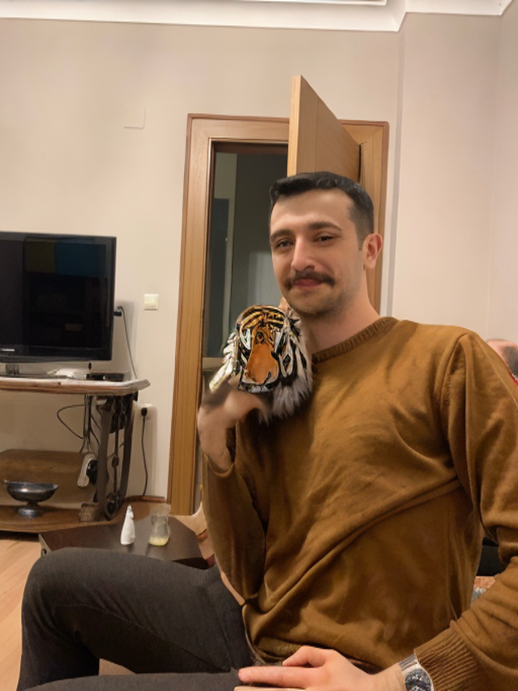

# SAM + CLIP + DIFFUSION

Stuff about this pipeline was a bit harder to run and follow, I wanted to write a simple package to allow people to use it with a higher level of abstraction. Based on the repos on the citation part.

<div style="display:flex;justify-content:center;">
  
  
  
</div>

## Installation

```bash
pip install samclipdiffusion
```

## Usage

```bash
!wget https://dl.fbaipublicfiles.com/segment_anything/sam_vit_h_4b8939.pth
```

```python
from samclipdiffusion import ImageSegmenter
segmenter_inp = ImageSegmenter()

image_path = 'image_path'
search_text = "target object"
prompt = "how to modify"

inpainted_image = segmenter_inp.inpaint_image(image_path, search_text, prompt)
```

## Examples

[Examples](/examples/) with and w/o installing the package.

## Citation

This repository is based on the following repos, I just merged them together and made some changes to make it work.

https://github.com/IDEA-Research/Grounded-Segment-Anything/blob/main/grounded_sam.ipynb
https://github.com/maxi-w/CLIP-SAM/blob/main/main.ipynb

## TODO

- [ ] Add more examples
- [ ] Optimize, make it memory efficient, it's awful right now
- [ ] Add better images to the examples :D
